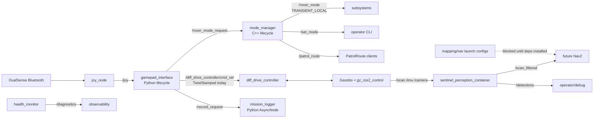

# Nexus Sentinel 工程文档

本文面向已经熟悉基本 Linux/ROS 2 命令的技术读者，记录 Nexus Sentinel 当前实现、取舍、验证方式和后续扩展入口。当前工程已经完成 Phase 0-10 的可运行基线；Nav2/slam_toolbox/twist_mux 的完整运行仍受当前 `nexus` 系统依赖限制，详见 `docs/DEPENDENCIES.md`。

## 架构



## 包职责

| Package | Role | Main assets |
| --- | --- | --- |
| `sentinel_interfaces` | 自定义通信接口 | `RoverMode.msg`, `Waypoint.msg`, `SetMode.srv`, `PatrolRoute.action` |
| `sentinel_description` | 机器人描述 | `urdf/sentinel.urdf.xacro`, `description.launch.py` |
| `sentinel_gazebo` | Gazebo 世界和桥接 | `sentinel_warehouse.sdf`, `sim.launch.py`, `bridge.yaml` |
| `sentinel_control` | ros2_control 配置 | `controllers.yaml`, `control.launch.py` |
| `sentinel_teleop` | DualSense 遥控 | `gamepad_interface.py`, `gamepad.yaml`, `gamepad.launch.py` |
| `sentinel_mission` | 模式管理、日志、诊断 | `mode_manager`, `mission_logger`, `health_monitor`, mission/diagnostics launches |
| `sentinel_perception` | C++ composable perception | `ScanFilterComponent`, `ImageMarkerComponent`, `perception.launch.py` |
| `sentinel_bringup` | 顶层组装 | teleop/mission/mapping/nav launch, Nav2/SLAM/twist_mux configs, demo map/route |

## Runtime Graph

| Entity | Type | QoS / Notes |
| --- | --- | --- |
| `/joy` | `sensor_msgs/msg/Joy` topic | `joy_node` input from DualSense |
| `/diff_drive_controller/cmd_vel` | `geometry_msgs/msg/TwistStamped` topic | Lyrical diff drive validated command topic |
| `/cmd_vel_lock` | `std_msgs/msg/Bool` topic | ESTOP lock for future `twist_mux` integration |
| `/rover_mode` | `sentinel_interfaces/msg/RoverMode` topic | Reliable + transient local, late subscribers get current mode |
| `/rover_mode_request` | `sentinel_interfaces/msg/RoverMode` topic | Teleop-to-mission mode request |
| `/set_mode` | `sentinel_interfaces/srv/SetMode` service | CLI/test mode changes |
| `/patrol_route` | `sentinel_interfaces/action/PatrolRoute` action | Phase 6 simulation-mode patrol action; Nav2 handoff deferred |
| `/scan_filtered` | `sensor_msgs/msg/LaserScan` topic | SensorDataQoS from `ScanFilterComponent` |
| `/detections` | `std_msgs/msg/String` topic | JSON summary from `ImageMarkerComponent` |
| `/diagnostics` | `diagnostic_msgs/msg/DiagnosticArray` topic | battery/controller health from `health_monitor` |

## 概念自检表

| ROS 2 concept | 落地位置 | 状态 |
| --- | --- | --- |
| C++ node | `sentinel_mission/src/mode_manager.cpp` | Implemented |
| Python node | `sentinel_teleop/gamepad_interface.py`, `mission_logger.py`, `health_monitor.py` | Implemented |
| Lifecycle node | `gamepad_interface`, `mode_manager` | Implemented |
| Topic | `/rover_mode`, `/scan_filtered`, `/diagnostics` | Implemented |
| Service | `/set_mode` | Implemented |
| Action | `/patrol_route` | Implemented |
| Parameters | `gamepad.yaml`, `perception.yaml`, `health_monitor` params | Implemented |
| Runtime parameter validation | `gamepad_interface` deadzone/range checks | Implemented |
| QoS variants | SensorDataQoS for sensors, transient local for `/rover_mode` | Implemented |
| Component container | `sentinel_perception/launch/perception.launch.py` | Implemented |
| Intra-process comms | `extra_arguments=[{'use_intra_process_comms': True}]` | Implemented |
| Executor | `EventsExecutor` in `mode_manager_main.cpp` | Implemented; local Lyrical lacks requested `CallbackGroupEventsExecutor` |
| Async Python | `mission_logger.py` uses `rclpy.experimental.AsyncNode` | Implemented |
| TF | `robot_state_publisher`, diff drive odom TF | Implemented in sim/control |
| Xacro/URDF | `sentinel.urdf.xacro` | Implemented with compatibility fallback |
| ros2_control | `sentinel_control/config/controllers.yaml` | Implemented and validated after dependencies installed |
| Gazebo simulation | `sentinel_gazebo/launch/sim.launch.py` | Implemented |
| Nav2/SLAM | `mapping.launch.py`, `nav.launch.py`, configs | Config baseline implemented; runtime blocked by missing packages |
| twist_mux arbitration | `twist_mux.yaml` | Config baseline implemented; runtime blocked by missing package/type verification |
| DualSense teleop | `sentinel_teleop` | Implemented |
| diagnostics | `health_monitor.py` | Implemented |
| rosbag2 remote control | record request topics exist; service wiring deferred | Partial |
| launch_testing | `test_mission_diagnostics_launch.py` | Implemented |
| RViz/headless visualization | README/DEPENDENCIES document headless SSH path | Documented |

## 设计取舍

`twist_mux` 没有手写仲裁逻辑，是因为遥控优先级、lock topic、超时行为已经是成熟 ROS 生态功能。当前机器未安装 `twist_mux`，所以 Phase 5 先把 teleop 直接接到 Lyrical 已验证的 `/diff_drive_controller/cmd_vel` `TwistStamped` 输入，并保留 `/cmd_vel_lock` 与 `twist_mux.yaml`。

`PatrolRoute` 不直接暴露 Nav2 action，是为了让上层只依赖项目自己的巡逻语义：waypoint 名称、dwell 时间、任务结果和反馈格式。Phase 6 在 Nav2 缺失时用 simulation-mode action 保持接口可测；Phase 7 预留了 Nav2 bringup/config，等依赖可用后把内部实现替换成 Nav2 action client。

`/rover_mode` 使用 reliable + transient local，因为它表示当前状态，不是高频流。`/scan` 和 `/scan_filtered` 使用 SensorDataQoS，因为传感器流应优先实时性。

## 新特性与本机差异

| Feature requested | Local finding | Project decision |
| --- | --- | --- |
| `CallbackGroupEventsExecutor` | 本机 Lyrical 提供 `rclcpp::experimental::executors::EventsExecutor` | 使用 `EventsExecutor` 并记录差异 |
| `AsyncNode` | `rclpy.experimental.AsyncNode` 可用 | `mission_logger.py` 使用该 API |
| URDF 1.2 `quat_xyzw`/`capsule` | 未在本机 parser/header 中确认支持 | 使用标准 URDF `rpy` 和 primitive fallback |
| rosidl buffer/GPU zero-copy | Phase 0 未检测到 NVIDIA/CUDA | Phase 8 使用 CPU intra-process component path |
| `launch_pytest` | 未安装 | 使用 `launch_testing_ament_cmake` |

## Build

```bash
cd ~/ros2_ws
source /opt/ros/lyrical/setup.bash
colcon build --event-handlers console_direct+
colcon test --event-handlers console_direct+
colcon test-result --verbose
```

常用窄范围验证：

```bash
colcon test --packages-select sentinel_mission --event-handlers console_direct+
colcon test --packages-select sentinel_perception --event-handlers console_direct+
```

## Run

基础仿真：

```bash
ros2 launch sentinel_gazebo sim.launch.py headless:=true
```

遥控：

```bash
ros2 launch sentinel_bringup teleop.launch.py
```

任务管理：

```bash
ros2 launch sentinel_bringup mission.launch.py
```

感知：

```bash
ros2 launch sentinel_perception perception.launch.py
```

诊断：

```bash
ros2 launch sentinel_mission diagnostics.launch.py
```

## Debugging

```bash
ros2 topic list -t
ros2 service list -t
ros2 action list -t
ros2 lifecycle get /mode_manager
ros2 topic echo /rover_mode --once
ros2 service info /set_mode --verbose
ros2 topic bw /diagnostics
ros2 doctor --report
```

Phase 9 实测：`/diagnostics` 约 `1.15-1.46 KB/s`，单条约 `0.35 KB`。`/set_mode --verbose` 显示 request/response endpoint 和 RELIABLE QoS。

## Troubleshooting

| Symptom | Likely cause | Check |
| --- | --- | --- |
| `ros2: command not found` | 没有 source ROS | `source /opt/ros/lyrical/setup.bash` |
| Nav launch exits early | Nav2/slam/twist_mux 缺失 | `ros2 launch sentinel_bringup nav.launch.py start_sim:=false` |
| No gamepad messages | DualSense 未连接或设备号变了 | `ls -l /dev/input/js*`, `jstest --normal /dev/input/js0` |
| Controllers not active | ros2_control packages/controller manager issue | `ros2 control list_controllers` |
| `.DS_Store` appears locally | macOS Finder metadata | 不要 copy/stage；`.gitignore` 已覆盖 |

## Testing Strategy

目前测试覆盖三层：

1. `ament_lint_auto`：CMake、XML、Python、C++ style。
2. Python 单元测试：`sentinel_teleop/test/test_gamepad_interface.py` 覆盖手柄映射。
3. launch integration：`sentinel_mission/test/test_mission_diagnostics_launch.py` 启动 mission stack，调用 `/set_mode` 并检查 `/diagnostics`。

新增测试时优先选择最小可复现范围：纯逻辑走单元测试，跨节点行为走 `launch_testing_ament_cmake`。

## Extension Guide

Phase 11 可从这些入口扩展：

- 机械臂：新增 `sentinel_manipulation` 或扩展 `sentinel_control`，接 `joint_trajectory_controller`。
- 多机：为 bringup launch 增加 namespace 参数，所有 topic/service/action 使用相对名。
- SROS2：先为 mission/perception/teleop 生成策略，再逐步收紧权限。
- Docker：当前按原生 nexus 部署，容器化应保留 `/dev/input/js*`、DDS 网络和 Gazebo GPU/CPU 渲染策略。
